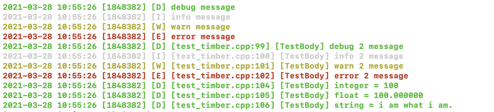

# mt-ccs

> 【规范+工具链】模块化、单元测试、例子编写、持续集成（CI自动化，拉代码后，可以全脚本化，不需要手动安装任何组件）、增量编译、交叉编译、


TODO:

- [x] clang-tidy 【lint tool + vscode plugin】已完成 https://github.com/Microsoft/clang-tools-extra/blob/master/test/clang-tidy/readability-identifier-naming.cpp
- [ ] CodeChecker...https://github.com/Ericsson/codechecker/blob/master/docs/install_macosx.md
- [ ] xmake 用于交叉编译 https://github.com/xmake-io/awesome-xmake
- [ ] cmake 深耕 https://searchcode.com/file/107122485/CMakeLists.txt/

## 工具

感谢：https://github.com/bast/gtest-demo

- [Google Test](https://github.com/google/googletest/blob/master/googletest/docs/primer.md)
- [Travis-CI](https://docs.travis-ci.com/)
- [Coveralls](https://coveralls.io/)
- [cmake必看书目](https://github.com/xiaoweiChen/CMake-Cookbook/blob/master/SUMMARY.md)
- [cmake必翻文档](https://cmake.org/cmake/help/v3.19/command/configure_file.html)
- 命令组合：
  - ldd <xx.so><executable> 查看链接关系
- [谷歌项目风格指南-c++](https://zh-google-styleguide.readthedocs.io/en/latest/google-cpp-styleguide/naming/#macro-names)
- [polly](https://polly.readthedocs.io/en/latest/toolchains/android.html), 一大波可用的cmake toolchain

### 工程构建

```bash
git clone https://github.com/fallending/BinartLibs-Cpp.git
cd BinartLibs-Cpp
mkdir build // out-of-source 编译
cd build
cmake ..
cmake --build .
```
## 使用指南

### BitBuffer

```c++
#include "/path/to/BitBuffer.h"
#include <iostream>

BitBuffer bb;
bb.write_bits(true, 1);
bb.write_bits(false, 1);
bb.write_bits(2, 2);
bb.write_bits(10, 4);
bb.write_byte(100);

std::cout << bb.read_bit(0) << std::endl;      // Prints out 1 (aka true)
std::cout << bb.read_bit(1) << std::endl;      // Prints out 0 (aka false)
std::cout << bb.read_bits(2, 2) << std::endl;  // Prints out 2
std::cout << bb.read_bits(4, 4) << std::endl;  // Prints out 10
std::cout << bb.read_byte(1) << std::endl;     // Prints out 100
std::cout << bb.read_bits(8, 8) << std::endl;  // Prints out 100
std::cout << bb.read_byte(0) << std::endl;     // 1010 1010, so it prints out 170
std::cout << bb.read_bytes(0, 2) << std::endl; // 1010 1010 0110 0100, so it prints out 43620

// Iterators

// Bit Iterator
for (BitBuffer::iterator iter = bb.begin(); iter != bb.end(); ++iter) {
    uint8_t bit = *iter;

    // Do stuff with bit
}

for (auto& bit : bb) {
    // Do stuff with bit
}

// Byte iterator
for (auto& byte : bb.get_bytes()) {
    // Do stuff with byte
}
```

### Timber
> 源码：src/timber
> 单测：tests/timber



**目录说明**

```
.
├── CMakeLists.txt
├── mt_leaf.h           单条日志辅助信息
├── mt_timber.h         日志中间层
├── mt_tree.h           日志中间件基类，负责重定向
└── mt_type.h
```

**使用参考**

```cpp
// [optional] 预定义标记
#define __TAG__ "Timber Unit Test"

// 引入头文件
#include "timber/mt_timber.h"

// 声明命名空间
using namespace timber;
using namespace std;

// 种树
shared_ptr<DebugTree> tree = make_shared<DebugTree>();
logger.plant(tree);

// 对象打印
logger.d("debug message");
logger.i("info message");
logger.w("warn message");
logger.e("error message");

// 宏打印
logd("debug 2 message");
logi("info 2 message");
logw("warn 2 message");
loge("error 2 message");
```
